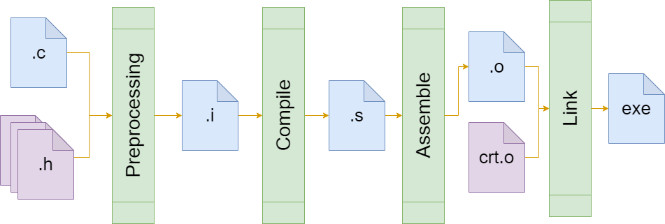

# Introduction

C's efficiency and closeness to hardware make it pivotal in systems and application development. This article guides you through the C compilation process, crucial for transforming code into executable programs. Designed for both beginners and experienced developers, it enhances understanding of C programming. 

You can follow along with the examples or read for insight, with active engagement recommended for better learning.

Prerequisites include a Linux machine, and examples utilize files from this [GitHub repository](https://github.com/dmgciubotaru/research/tree/ccompile).

# Overview of the C Compilation Process


The C compilation process transforms human-readable code into an executable program through a series of stages. Here's a brief overview of each phase:

- **Preprocessing**: Resolves directives like `#include` and `#define`, preparing the source code for compilation.
- **Compilation**: Converts preprocessed code into assembly language, translating high-level constructs into a lower-level format.
- **Assembly**: Transforms assembly code into machine code, producing object files with binary code that the processor can understand.
- **Linking**: Combines object files and libraries into a single executable file, resolving references to create a standalone program.

To demonstrate these steps, we'll use this [main.c](https://github.com/dmgciubotaru/research/blob/ccompile/main.c) file that includes various C elements specifically chosen to showcase how the compiler handles different aspects of the language.

# Preprocessing

The preprocessing phase is the first step in the C compilation process. It involves the preprocessor analyzing the source code and executing directives before the actual compilation begins. These directives, identified by a `#` symbol.

## Key Steps in the Preprocessing Process

- **Macro Expansion**: Replaces macros defined using `#define` with their corresponding values or code snippets throughout the code.

- **File Inclusion**: Incorporates the contents of included files using `#include` into the source code. This is used for providing declarations and definitions used in the program as well as improve the code reusability.

- **Conditional Compilation**: Allows compiling different sections of code depending on certain conditions, enabling more versatile and adaptable code using `if` like constructuions. (`#if`, `#ifdef`, `#ifndef`, `#else`, `#elif`, `#endif`)

Preprocessing paves the way for the next phases of compilation by streamlining the source code, ensuring it's in an ideal format for conversion into machine code.

To preprocess the `main.c` file, use the command `gcc -E main.c -o main.i`. This generates the preprocessed file, `main.i`.

Inspecting the output reveals several key changes:

### Expansion of Header Files and Introduction of Linemarkers:
   The header files are expanded, and [linemarkers](https://gcc.gnu.org/onlinedocs/gcc-3.0.2/cpp_9.html) are introduced to track file names and line numbers. Linemarkers are a feature of the GCC preprocessor that helps in identifying the origins of each line of code. For example:

   ```c
   # 1 "/usr/include/stdio.h" 1 3 4    // Enters stdio.h header
   ...
   # 1 "/usr/lib/gcc/x86_64-linux-gnu/11/include/stddef.h" 1 3 4   // Enters stddef.h as stdio.h includes stddef.h
   # 209 "/usr/lib/gcc/x86_64-linux-gnu/11/include/stddef.h" 3 4   // Sets source and line number
   typedef long unsigned int size_t;                               // The type defined in stddef.h at line 209
   # 34 "/usr/include/stdio.h" 2 3 4                               // Returns from stddef.h header
   ```

### Macro Expansion
   Macros are expanded to their corresponding definitions. This can be observed in how `ERROR(msg)` is processed:

   ```c
   // In main.c
   #define ERROR(msg) {printf("Error: %s", msg); exit(-1);}
   ...
   ERROR("No name provided");

   // In main.i after preprocessing
   {printf("Error: %s", "No name provided"); exit(-1);};
   ```

   The `ERROR` macro in `main.c` is replaced in `main.i` with its defined content. The argument `"No name provided"` replaces `msg` in the macro's body. This process simplifies the code and aids in debugging by providing a more readable output.

Understanding and using C preprocessing can provide several advantages:

- **Debugging Imports**: By examining the preprocessed file (`main.i`), you can verify which headers are included and in what order. This is particularly useful for resolving issues related to conflicting or missing declarations.

- **Debugging Macro Expansions**: Seeing how macros expand in the preprocessed code can clarify their impact on the program. This is crucial for debugging and ensuring that macros behave as expected.

- **Debugging Conditional Blocks**: Preprocessing reveals how conditional compilation directives (`#if`, `#ifdef`, etc.) are resolved. This can help in understanding the flow of compilation and ensuring that the correct code blocks are compiled.

# Compilation to Assembly

After preprocessing, the next step in the C compilation process is the actual compilation. This phase involves translating the preprocessed C code into assembly language. A few key aspects of this phase are:

## Key Steps in the Compilation Process

- **Translating Instructions**: The compiler converts C language constructs and instructions into their corresponding assembly counterparts.

- **Memory Allocation for Variables and Constants**: During this phase, the compiler allocates memory for both global and local variables, as well as constants. Global variables are usually placed in a data segment, while local variables are allocated on the stack.

- **Program Section Construction**: The compiler organizes the code into various sections, such as `.text` for the executable code, `.data` for initialized global and static variables, and `.rodata` for read-only data like string literals.

- **Generating Debug and Other Sections**: Additional sections for debugging information and other metadata are also generated, which can be used for debugging and optimizing the code.

To compile the preprocessed file `main.i` into assembly, we use the `-S` option with GCC `gcc -S -masm=intel main.i -o main.s`. This generates the assembly code using Intel syntax. You can omit the `-masm=intel` parameter to output the code in `AT&T` flavor.

Let's examine how specific C constructs are represented in the assembly code (`main.s`):

### Constants Definition
Assembly places constants, such as string literals, in the `.rodata` section, ensuring they are read-only.

```assembly
   .section	.rodata            ; Specify target section for next declarations
.LC0:                          ; Label for "Anonimus" string
	.string	"Anonimus"         ; String definition, .string instructs the assembler to add an ending 0 to the string constant
.LC1:                          ; Different labels for different string constants
	.string	"No name provided"  
.LC2:
	.string	"Error: %s"
.LC3:
	.string	"Hello %s"
```

### Global Variable Allocation
Global variables are allocated in the `.data` section and initialized appropriately. The following snippet shows the "name" variable allocation.

```assembly
   .section .data.rel.local,"aw" ; Set the target section (.data)
   .align 8                      ; The alignment is 8 bytes (due to 64 bit architecture)
   .type name, @object           ; Specify the type of the "name" variable
   .size name, 8                 ; Specify the size of the variable (pointer types has 8 bytes)
name:                            ; "name" label
   .quad .LC0                    ; Allocate 8 bytes (.quad) and initialize with .LC0 address 
```

### Function Call Translation (Example: `strlen`)
The assembly translation of a `strlen` function call demonstrates stack space allocation, parameter passing, and function calling convention.

```assembly
; Original C code
; len = strlen(name);

   sub	rsp, 32                    ; Allocate space on stack for local variable and other intermediary values
   ...
   mov	rax, QWORD PTR name[rip]   ; Resolve the address or name that is relative to RIP
   mov	rdi, rax                   ; Move the address in rdi register (that is the first param for functions)
   call	strlen@PLT                 ; Call strlen function
   mov	DWORD PTR -4[rbp], eax     ; Store the function result (eax) in allocated stack variable
   
```
### Conditional Statement Translation (Example: `if` Statement)
The translation of an `if` statement into assembly involves condition checking and branching based on the comparison result.

```
   ; Original C code
   ; if(argc != 2)
   ; {...}
   mov DWORD PTR -20[rbp], edi    ; Store argc (first param of main function) on stack
   ...
   cmp DWORD PTR -20[rbp], 2      ; Compare the argc with 2
   je .L2                         ; if equal, jump to label .L2, otherwise continue the execution
   ...                            ; positive branch
.L2:                                
   ...                            ; rest of the code after if statement
```

These examples from `main.s` illustrate the assembly translation of constants, global variables, function calls, and conditional statements, highlighting the compiler's role in transforming high-level C code into low-level assembly instructions. Additionally, debug information and compiler-specific data are included in the assembly file, aiding in development and debugging processes.

# Assembly to binary object

This phase converts the human-readable assembly code (`.s` files) into machine code, encapsulated in binary object files (`.o` files). Typically, these object files are in the Executable and Linkable Format (ELF), which provides a versatile standard for storing the compiled code along with necessary metadata for linking.

## Key Steps in the Assembly Process:

- **Section Composition**: The assembler consolidates data from similar sections across the assembly source into the ELF object file. This ensures that all data, code, and other section types are appropriately merged, leveraging the ELF format's capabilities to organize and manage section information.

- **Instruction Translation**: Assembly instructions are translated from human-readable form into binary code (bytecode) that the CPU can directly execute. This process is specific to the target CPU's instruction set, with the ELF object file storing the translated machine instructions.

- **Label Resolution**: In the ELF object file, labels within the assembly code, marking function entry points or data locations, are replaced with actual memory addresses. This step is crucial for ensuring accurate execution flow and data access when the program runs.

- **Relocation Table Creation**: A relocation table is generated within the ELF object file. Because the final memory addresses of sections or symbols are not determined until the linking stage, the relocation table specifies which addresses in the code need to be updated based on the sections' eventual base addresses.

- **Symbol Table Generation**: The ELF object file includes a symbol table, which lists all symbols (function and variable names) used in the assembly code along with their addresses or relocation information. This table is crucial for linking, as it allows the linker to resolve external references between different object files.

- **Debug Information**: If included, debug information is stored in specific sections within the ELF object file. This information maps the machine code back to the source code, enabling developers to debug the compiled program at the source level.

The ELF format's design to accommodate these steps makes `.o` files particularly suited for the subsequent linking process, moving the assembly code closer to becoming a complete executable program.

To transform assembly code into an object file, the GNU assembler (`as`) can be utilized directly:

```bash
as main.s -o main.o
```

While `gcc` can also perform this compilation, using `as` directly provides a clearer view into the assembly-to-binary object file conversion process.

Since `main.o` is a binary file (ELF format), viewing it in a text editor is not informative. Instead, the `readelf` and `objdump` utility offers a way to inspect ELF files thoroughly.

### Inspecting the ELF sections

To explore the sections within `main.o` and understand their organization, the following `readelf` command can be used:

```bash
readelf -W -S main.o
```

This reveals the sections in `main.o`, including their names, offsets, sizes, and attributes, providing insights into the compiler's data and code organization and the preparations for linking.

```
  [Nr] Name              Type            Address          Off    Size   ES Flg Lk Inf Al
  [ 0]                   NULL            0000000000000000 000000 000000 00      0   0  0
  [ 1] .text             PROGBITS        0000000000000000 000040 00008a 00  AX  0   0  1
  [ 2] .rela.text        RELA            0000000000000000 000288 000108 18   I 13   1  8
  [ 3] .data             PROGBITS        0000000000000000 0000ca 000000 00  WA  0   0  1
  [ 4] .bss              NOBITS          0000000000000000 0000ca 000000 00  WA  0   0  1
  [ 5] .rodata           PROGBITS        0000000000000000 0000ca 00002d 00   A  0   0  1
  [ 6] .data.rel.local   PROGBITS        0000000000000000 0000f8 000008 00  WA  0   0  8
  [ 7] .rela.data.rel.local RELA         0000000000000000 000390 000018 18   I 13   6  8
  [ 8] .comment          PROGBITS        0000000000000000 000100 00002c 01  MS  0   0  1
  [ 9] .note.GNU-stack   PROGBITS        0000000000000000 00012c 000000 00      0   0  1
  [10] .note.gnu.property NOTE           0000000000000000 000130 000020 00   A  0   0  8
  [11] .eh_frame         PROGBITS        0000000000000000 000150 000038 00   A  0   0  8
  [12] .rela.eh_frame    RELA            0000000000000000 0003a8 000018 18   I 13  11  8
  [13] .symtab           SYMTAB          0000000000000000 000188 0000d8 18     14   4  8
  [14] .strtab           STRTAB          0000000000000000 000260 000025 00      0   0  1
  [15] .shstrtab         STRTAB          0000000000000000 0003c0 000089 00      0   0  1
```

### Inspecting the `.rodata` Section

To view the contents of the `.rodata` section, where string constants are stored, use the `readelf` command:

```bash
readelf -x .rodata main.o
```

This command dumps the content of the `.rodata` section, revealing the raw bytes and the strings added to this section in the assembly file:

```text
Hex dump of section '.rodata':
  0x00000000 416e6f6e 696d7573 004e6f20 6e616d65  Anonimus.No name
  0x00000010 2070726f 76696465 64004572 726f723a  provided.Error:
  0x00000020 20257300 48656c6c 6f202573 00        %s.Hello %s.
```

### Inspecting the `.text` Section

Similarly, to inspect the `.text` section, which contains the executable code, run:

```bash
readelf -x .text main.o
```

```text
Hex dump of section '.text':
  0x00000000 f30f1efa 554889e5 4883ec20 897dec48 ....UH..H.. .}.H
  0x00000010 8975e083 7dec0274 28488d05 00000000 .u..}..t(H......
  0x00000020 4889c648 8d050000 00004889 c7b80000 H..H......H.....
  0x00000030 0000e800 000000bf ffffffff e8000000 ................
  0x00000040 00488b45 e0488b40 08488905 00000000 .H.E.H.@.H......
  0x00000050 488b0500 00000048 89c7e800 00000089 H......H........
  0x00000060 45fc488b 05000000 004889c6 488d0500 E.H......H..H...
  0x00000070 00000048 89c7b800 000000e8 00000000 ...H............
  0x00000080 bf000000 00e80000 0000              ..........
```

To translate the bytecode into a more understandable format, use `objdump` to decompile it:

```bash
objdump -M intel -d -j .text main.o
```

This provides a disassembled view of the `.text` section, translating bytecode back into assembly instructions:

```text
0000000000000000 <main>:
   0:   f3 0f 1e fa             endbr64
   4:   55                      push   rbp
   5:   48 89 e5                mov    rbp,rsp
   8:   48 83 ec 20             sub    rsp,0x20
   c:   89 7d ec                mov    DWORD PTR [rbp-0x14],edi
   f:   48 89 75 e0             mov    QWORD PTR [rbp-0x20],rsi
  13:   83 7d ec 02             cmp    DWORD PTR [rbp-0x14],0x2
  17:   74 28                   je     41 <main+0x41>
  19:   48 8d 05 00 00 00 00    lea    rax,[rip+0x0]        # 20 <main+0x20>
  20:   48 89 c6                mov    rsi,rax
  23:   48 8d 05 00 00 00 00    lea    rax,[rip+0x0]        # 2a <main+0x2a>
   ...
```

### Inspecting Symbols

To display the symbols in `main.o`, including defined and imported functions, use the `readelf` command with the `-s` option:

```bash
readelf -s main.o
```

This command prints the symbol table, showing symbols like `main`, `name`, and imported functions such as `printf` or `exit`:

```text
Symbol table '.symtab' contains 9 entries:
   Num:    Value          Size Type    Bind   Vis      Ndx Name
     0: 0000000000000000     0 NOTYPE  LOCAL  DEFAULT  UND
     1: 0000000000000000     0 FILE    LOCAL  DEFAULT  ABS main.c
     2: 0000000000000000     0 SECTION LOCAL  DEFAULT    1 .text
     3: 0000000000000000     0 SECTION LOCAL  DEFAULT    5 .rodata
     4: 0000000000000000     8 OBJECT  GLOBAL DEFAULT    6 name
     5: 0000000000000000   138 FUNC    GLOBAL DEFAULT    1 main
     6: 0000000000000000     0 NOTYPE  GLOBAL DEFAULT  UND printf
     7: 0000000000000000     0 NOTYPE  GLOBAL DEFAULT  UND exit
     8: 0000000000000000     0 NOTYPE  GLOBAL DEFAULT  UND strlen
```
    
### Inspecting the Relocations

To view the relocation entries in `main.o`, which are crucial for linking, use the `readelf` command with the `-r` option:

```bash
readelf -r main.o
```

This command displays the relocation sections, showing how symbols in the code are adjusted during the linking process:

```text
Relocation section '.rela.text' at offset 0x288 contains 11 entries:
  Offset          Info           Type           Sym. Value    Sym. Name + Addend
00000000001c  000300000002 R_X86_64_PC32     0000000000000000 .rodata + 5
000000000026  000300000002 R_X86_64_PC32     0000000000000000 .rodata + 16
000000000033  000600000004 R_X86_64_PLT32    0000000000000000 printf - 4
00000000003d  000700000004 R_X86_64_PLT32    0000000000000000 exit - 4
00000000004c  000400000002 R_X86_64_PC32     0000000000000000 name - 4
000000000053  000400000002 R_X86_64_PC32     0000000000000000 name - 4
...
```

Each entry specifies how and where to adjust symbol references. For example, the relocation at offset `0x1c` in the `.text` section (`lea rax,[rip+0x0]`) instructs the loader to update the address for the string "No name provided", based on the actual location of `.rodata` at runtime. This process ensures that references to variables, functions, and constants are correctly resolved, regardless of where sections are loaded in memory.

More detailed information on relocation types and their purposes can be found in the ELF specification for the x86-64 architecture: [ELF x86_64 ABI](https://refspecs.linuxbase.org/elf/x86_64-abi-0.98.pdf).

# Linking

The linking process is the final stage in the compilation process, where multiple binary object files are combined into a single executable.

## Key Aspects of Linking:

- **Combining Sections**: The linker merges similar sections from all the object files into unified sections in the final executable. For instance, all `.text` sections from different object files are combined into a single `.text` section.

- **Resolving Imported Symbols**: The linker resolves symbols that are imported from other object files or libraries. This includes linking function calls to their definitions, whether those are included in static libraries included at compile time or dynamic libraries loaded at runtime.

- **Creating Segments**: The linker also organizes the combined sections into segments. Segments are portions of the executable that are loaded into memory during execution. This organization is essential for the runtime execution of the program, distinguishing between code, data, and other necessary information.

Due to the complexity of directly invoking the linker (`ld`), including the need to specify a linker script, include C libraries, and ensure the C runtime is correctly initialized, it is common practice to use `gcc` for this task. `gcc` abstracts away these complexities and provides a more straightforward interface for linking:

```bash
gcc main.o -o main
```

### Inspecting the segments

In the linking process, one important aspect is understanding the segments (also referred to as program headers) that make up the final executable. These segments define how the executable is organized in memory when it's loaded and executed. You can inspect these segments using the `readelf` command:

```bash
readelf -l main
```

The output provides detailed information about the segments, including their loading address in memory, size, size in memory, and alignment.

```
Program Headers:
  Type           Offset   VirtAddr           PhysAddr           FileSiz  MemSiz   Flg Align
  PHDR           0x000040 0x0000000000000040 0x0000000000000040 0x0002d8 0x0002d8 R   0x8
  INTERP         0x000318 0x0000000000000318 0x0000000000000318 0x00001c 0x00001c R   0x1
      [Requesting program interpreter: /lib64/ld-linux-x86-64.so.2]
  LOAD           0x000000 0x0000000000000000 0x0000000000000000 0x0006b0 0x0006b0 R   0x1000
  LOAD           0x001000 0x0000000000001000 0x0000000000001000 0x000221 0x000221 R E 0x1000
  LOAD           0x002000 0x0000000000002000 0x0000000000002000 0x000110 0x000110 R   0x1000
  LOAD           0x002da8 0x0000000000003da8 0x0000000000003da8 0x000270 0x000278 RW  0x1000
  DYNAMIC        0x002db8 0x0000000000003db8 0x0000000000003db8 0x0001f0 0x0001f0 RW  0x8
  NOTE           0x000338 0x0000000000000338 0x0000000000000338 0x000030 0x000030 R   0x8
  NOTE           0x000368 0x0000000000000368 0x0000000000000368 0x000044 0x000044 R   0x4
  GNU_PROPERTY   0x000338 0x0000000000000338 0x0000000000000338 0x000030 0x000030 R   0x8
  GNU_EH_FRAME   0x002034 0x0000000000002034 0x0000000000002034 0x000034 0x000034 R   0x4
  GNU_STACK      0x000000 0x0000000000000000 0x0000000000000000 0x000000 0x000000 RW  0x10
  GNU_RELRO      0x002da8 0x0000000000003da8 0x0000000000003da8 0x000258 0x000258 R   0x1

 Section to Segment mapping:
  Segment Sections...
   00
   01     .interp
   02     .interp .note.gnu.property .note.gnu.build-id .note.ABI-tag .gnu.hash .dynsym .dynstr .gnu.version .gnu.version_r .rela.dyn .rela.plt
   03     .init .plt .plt.got .plt.sec .text .fini
   04     .rodata .eh_frame_hdr .eh_frame
   05     .init_array .fini_array .dynamic .got .data .bss
   06     .dynamic
   07     .note.gnu.property
   08     .note.gnu.build-id .note.ABI-tag
   09     .note.gnu.property
   10     .eh_frame_hdr
   11
   12     .init_array .fini_array .dynamic .got
```

For instance, the .data section, which contains the "name" variable, is part of the 5th segment. Note that the MemSiz of this segment is greater than FileSiz by 8 bytes, indicating that space for the variable is allocated at runtime but is not present in the ELF file.

# Conclusion

In wrapping up our exploration of the C compilation process, it's vital to recognize how each stage—preprocessing, compiling, assembling, and linking—serves as a cornerstone in transforming C code into a functioning program. This journey from code to executable is not just a technical necessity but a foundation for better programming practices. By understanding the intricacies of each phase, developers can optimize their code, troubleshoot more efficiently, and ultimately enhance the performance and reliability of their software. Embrace this knowledge to unlock new levels of programming mastery.